<table><tr>
<th>
  
</th>
<th>
   
  Sezam BBS  
  Read cult BBS messages 
  from legendary users!
    
  Pretraga i čitanje kompletne arhive 
  kultnog Sezam BBS-a (1989-1999).  
  Preko pola miliona nostalgičnih poruka 
  iz prošlih (srećnijih?) vremena 
  koje su pisali legendarni korisnici.  
  September 16th, 2026 
  Now on App Store!  
  <a href="https://apps.apple.com/us/app/sezam-bbs/id6811744525" float="left">    
     </a> 
</th>
</tr>
</table>

**Sezam BBS on iPhone**

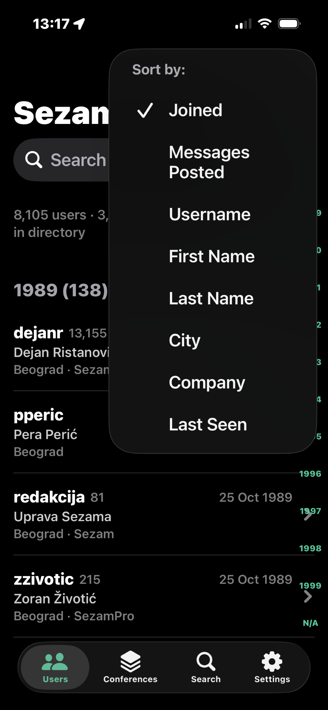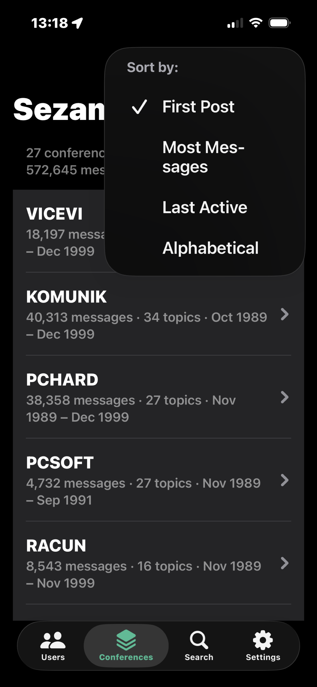
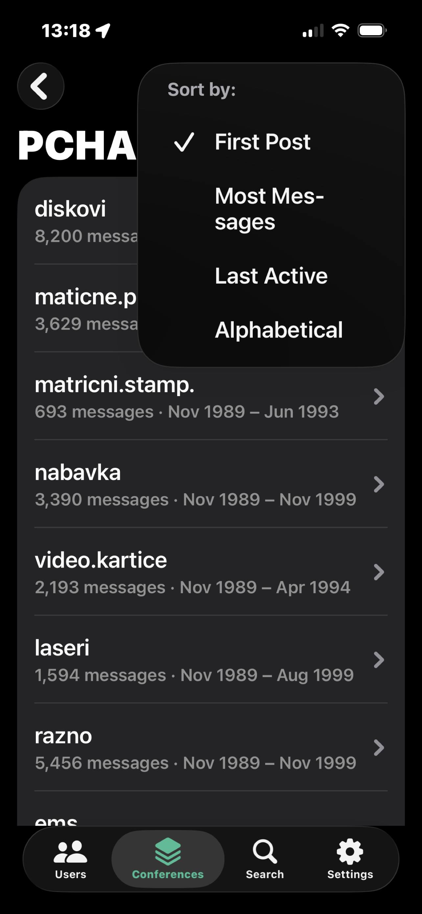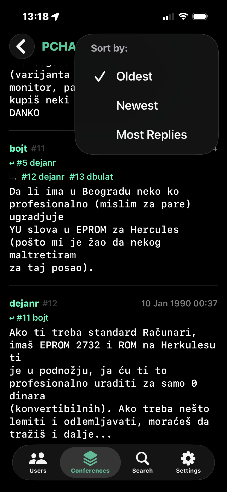
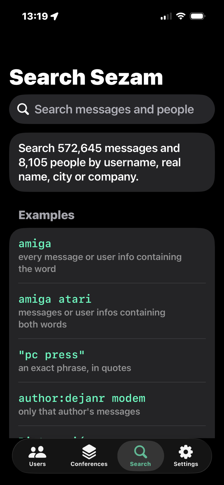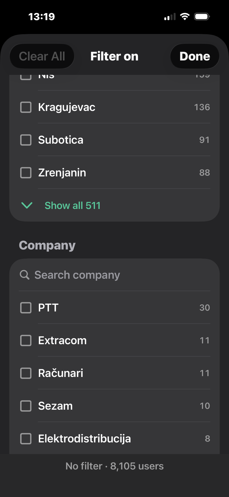
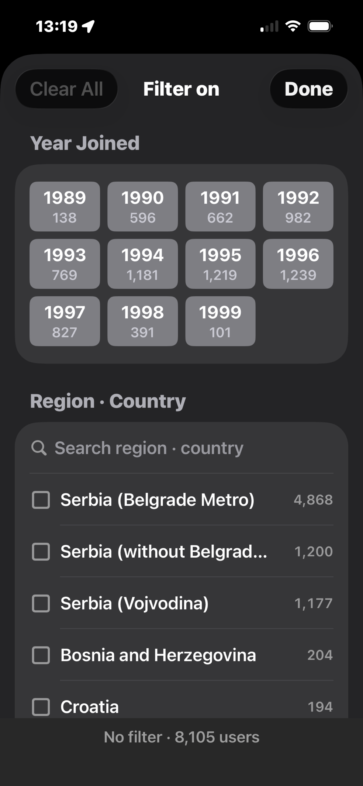

**Sezam BBS on iPad**

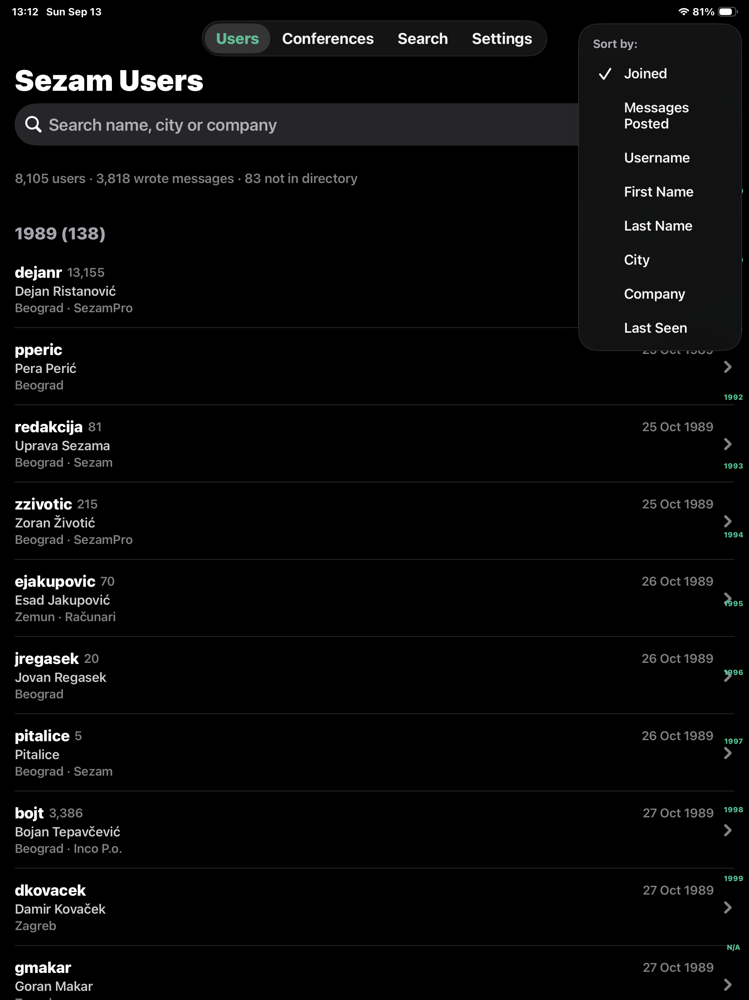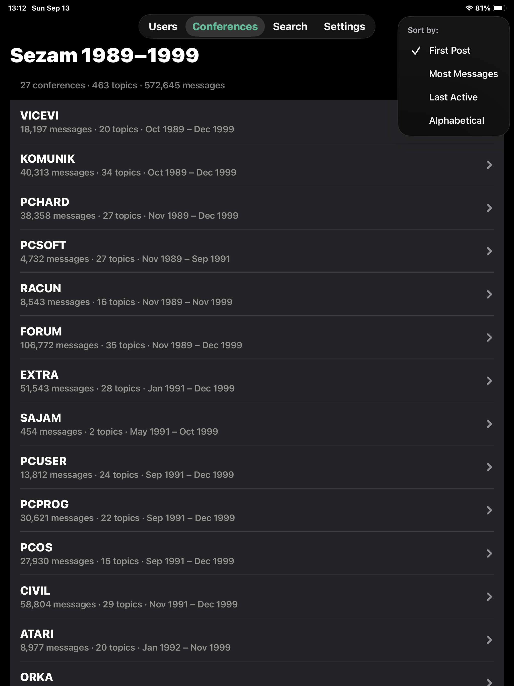
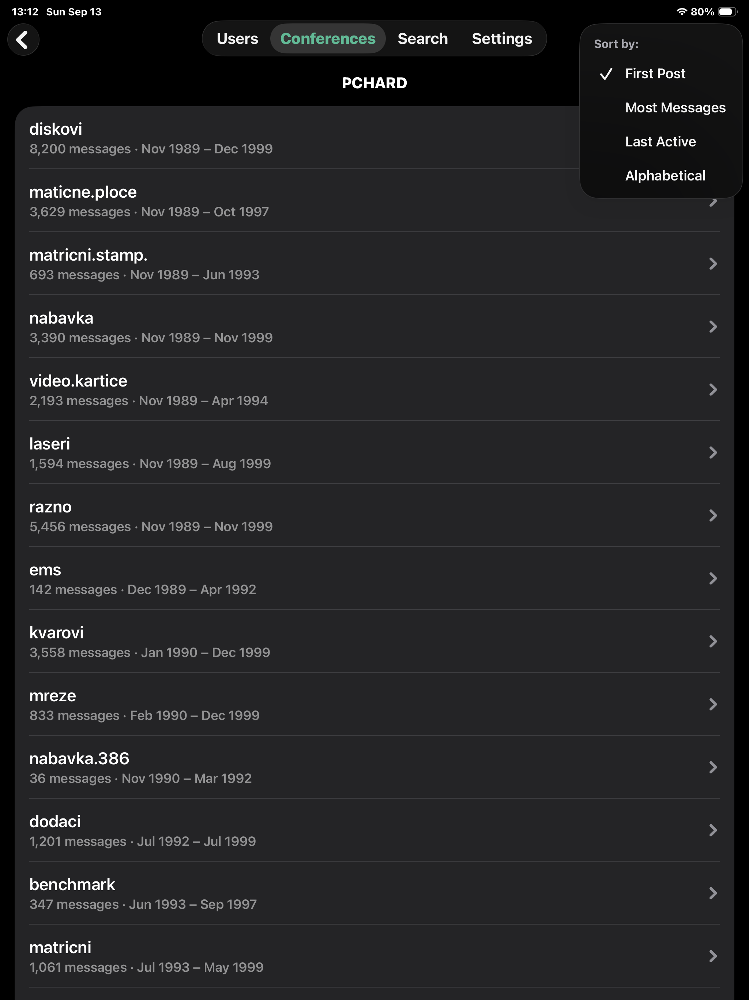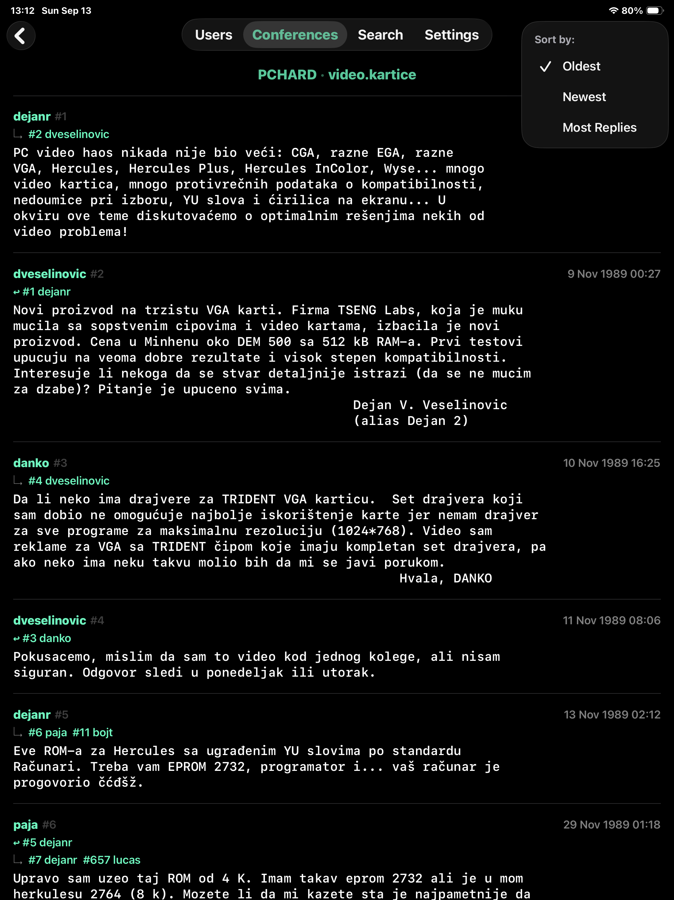
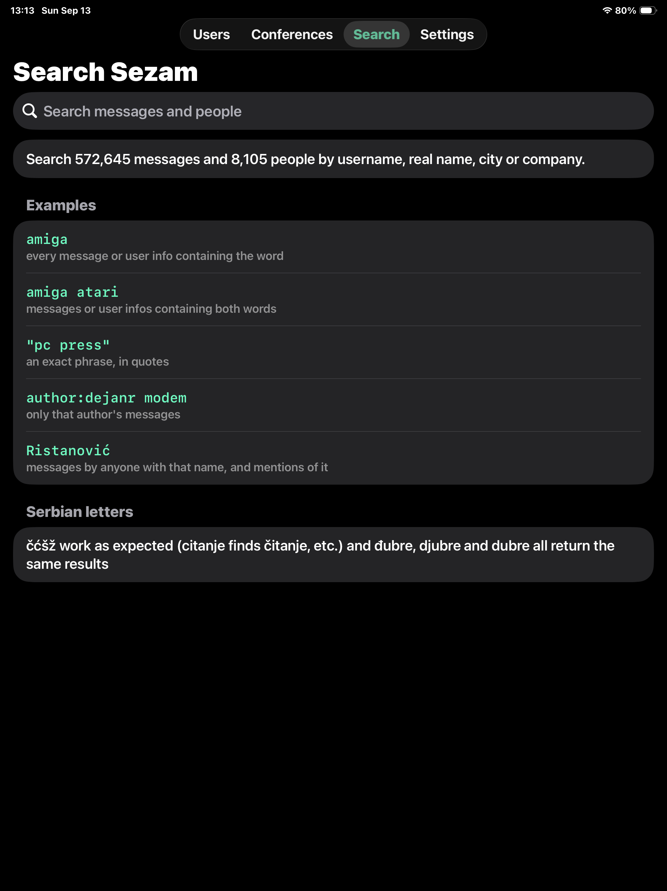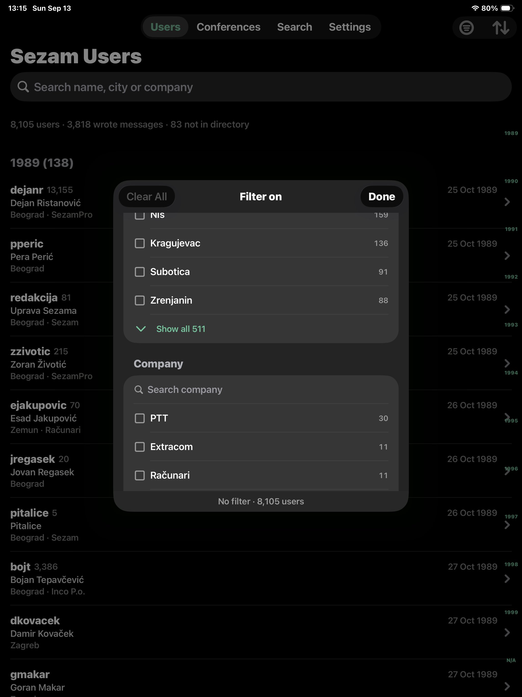
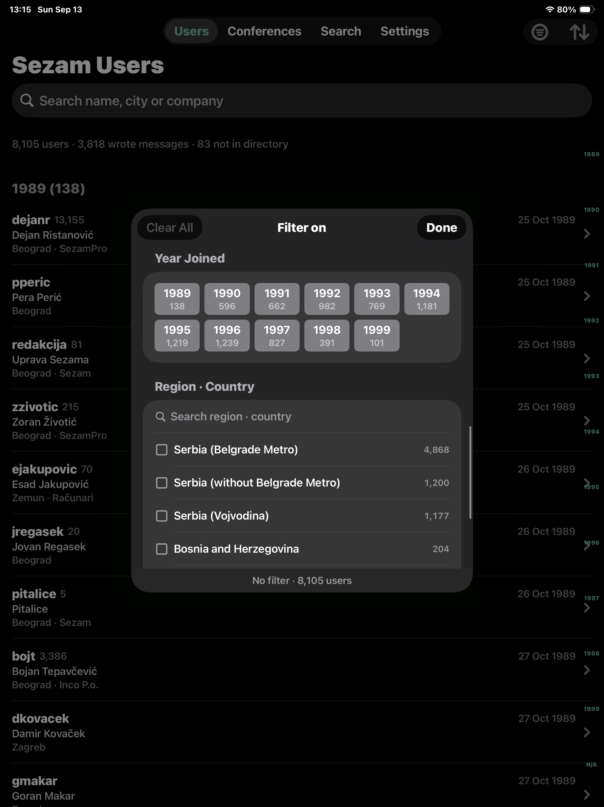

---

**Kompletan Sezam BBS na vasem iPhone-u ili iPad-u!**

<a href="https://apps.apple.com/us/app/sezam-bbs/id6811744525" float="left">
     </a>

- Sezam BBS je bio kultno virtuelno mesto gde se okupljala domaća ("ex-YU") računarska scena, deceniju pre nego što je komunikacija internetom postala svakodnevica

- Aplikacija sadrži kompletnu Sezam BBS arhivu, od 1989. do 1999. godine, preuzetu sa public domain oldsezam.net sajta

- 572.645 poruka iz svih 27 konferencija (463 teme)
- Imenik od 8.105 korisnika: pretraga kao i sortiranje po datumu učlanjenja, broju poruka, zadnjem javljanju, imenu, gradu, firmi
- Pretraga celog teksta poruka i sortiranje rezultata po relevantnosti, najviše odgovora, vremenu
- Praćenje odgovora unutar diskusija kroz linkove na sve povezane poruke

- Ako ste nekada bili "sezamovac" (kao ja - mihailod), potražite sebe i poruke koje ste u to davno (srećnije?) vreme pisali!

- Slede neke zanimljivosti iz arhive a ubeđen sam da ćete otkriti mnogo više...

  - Od 8.105 korisnika, 3.818 (47%) je napisalo barem jednu poruku
  - Prvih 5 ličnih korisnika po vremenu učlanjenja: dejanr, zzivotic, ejakupovic, jregasek, bojt
  - Top 5 (ličnih) korisnika po broju napisanih poruka: dejanr, spantic, dr.grba, madamov, fancy
  - Top 5 (od 511) gradova po zastupljenosti članova (bez Beograd metro-a): Novi Sad, Niš, Kragujevac, Subotica, Zrenjanin
  - Top 5 (od 1.377) firmi (ne računajući Sezam i Računare) u kojima su korisnici radili: PTT, Extracom, Elektrodistribucija, Institut "Mihajlo Pupin", Zli Kablovi
  - Sve zemlje korisnika iz inostranstva: Francuska, Nemačka, Švajcarska, SAD, Australija, Kanada, Kipar, Mađarska, Velika Britanija, SSSR, Belgija, Bocvana, Danska, Finska, Holandija, Švedska
  - Poruku sa najviše odgovora (63) je napisao korisnik berg i počinje ovako: "P O M O C !!!!! Windows mi prilikom instalacije (kada treba da se podigne radi daljeg setup-a) izbacuje instalaciju i prijavljuje sledece..."
  - Otkrijte šta se desilo bergu, koji su mu legendarni sezamovci priskočili u pomoć i da li su uspeli… - instalirajte Sezam BBS app!

<a href="https://apps.apple.com/us/app/sezam-bbs/id6811744525" float="left">
     </a> 

---

## Sezam BBS License

**Content:** The app bundles public domain content from [oldsezam.net](https://oldsezam.net).

**Code:** Copyright © Mihailo Despotovic, 2026. Licensed under [PolyForm Noncommercial 1.0.0](LICENSE).
* 🟢 **Free to use** for personal, educational, research, and non-commercial projects.
* 🔴 **Commercial use prohibited.** If you intend to use my code in any way in any revenue-generating product, you must contact me for a commercial license.

<a href="https://apps.apple.com/us/app/sezam-bbs/id6811744525" float="left">
     </a> 
